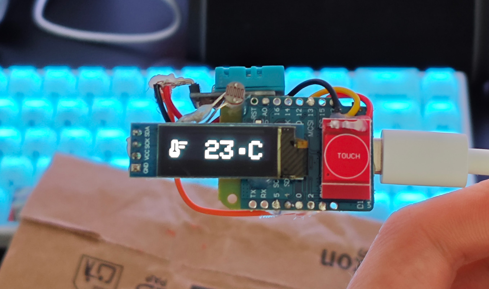
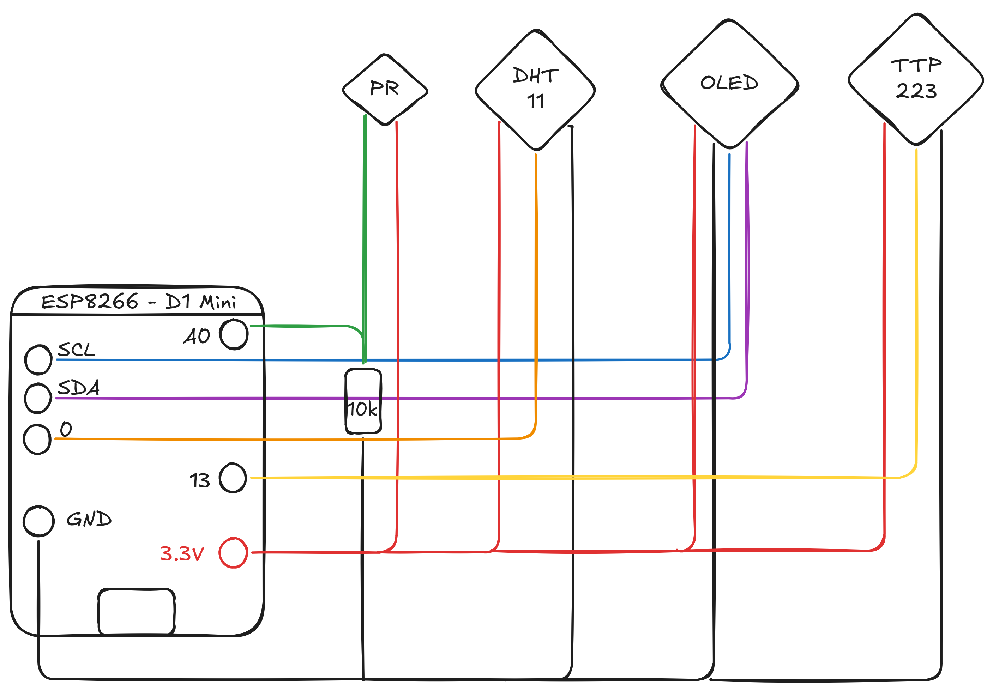
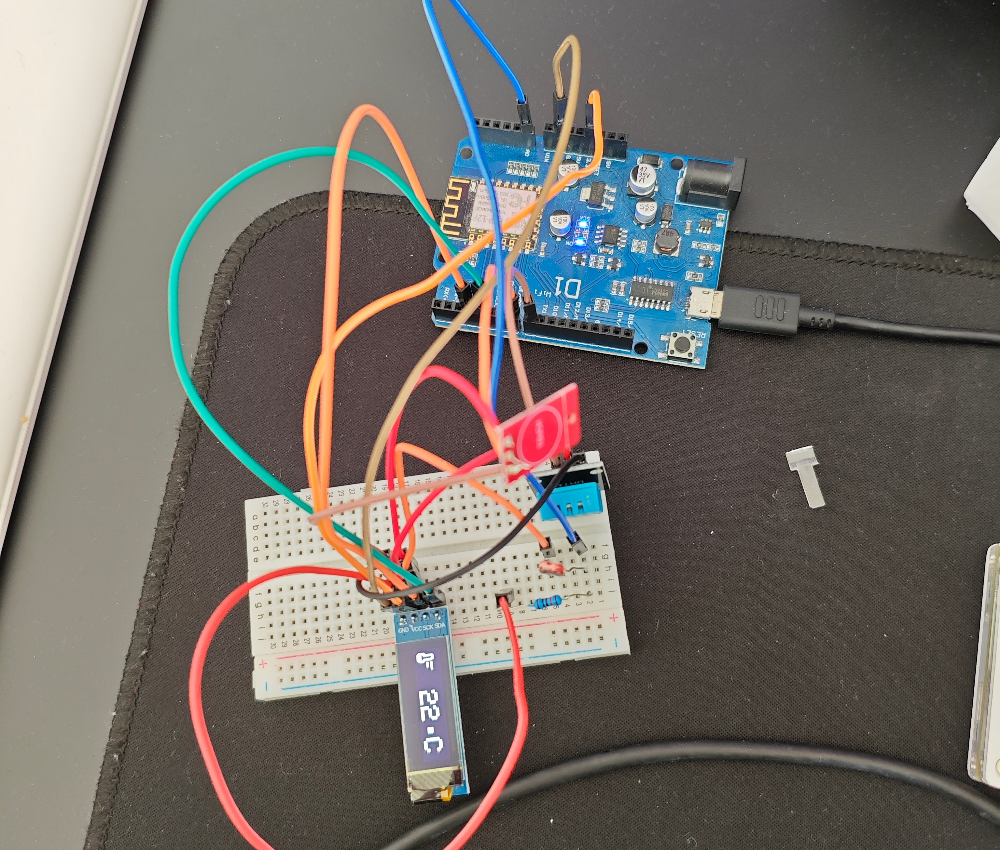
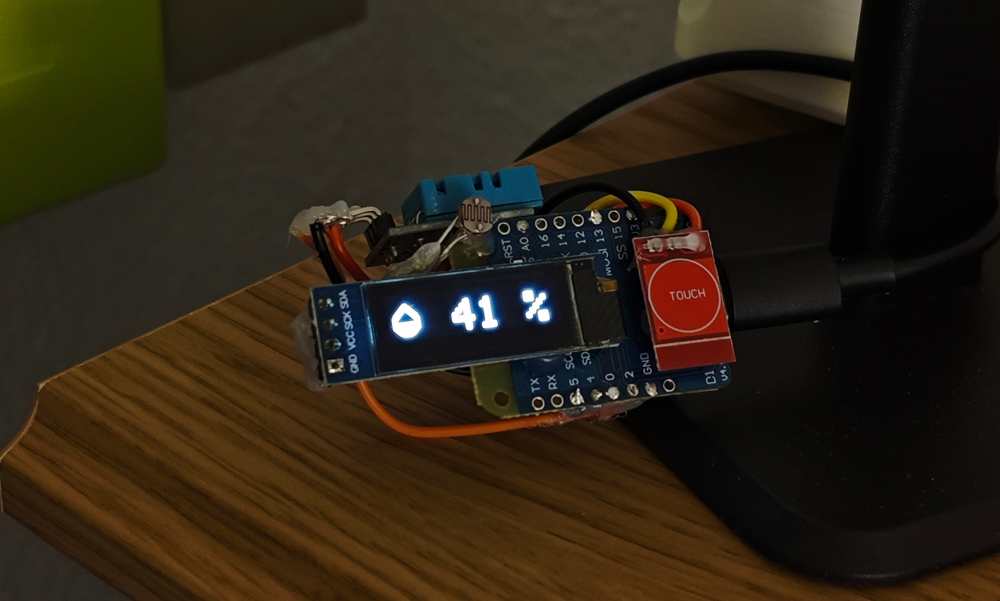

I recently found a DHT11 sensor lying around in a drawer, and I thought it was the perfect opportunity to make a fun little project. I'm going to show you how to build a thermometer with an ESP8266 and a DHT11 sensor. This project is perfect for beginners who want to get familiar with the ESP8266 and temperature/humidity sensors.

## Prerequisites

Required:

- An ESP8266 (I'll use a [Wemos D1 Mini](https://www.wemos.cc/en/latest/d1/d1_mini.html) but any model will do)
- A DHT11 sensor
- A 128x32 OLED screen
- Connection wires (Dupont wires work fine)
- Soldering equipment (iron, solder, etc.) or a breadboard
- A PC with VSCode and PlatformIO installed, or any other IDE of your choice
- A bit of patience

Optional:

- A photoresistor to turn off the screen at night (otherwise I can't sleep)
- A capacitive sensor to switch the display between temperature and humidity (it's a bit gimmicky but I wanted to play with it)

## Assembly

All sensors are powered at 3.3V, so no power supply issues.
Each sensor has its own pin for data, with the only exception being the OLED screen which uses the I2C bus (so only two pins) and the photoresistor which is connected to an analog pin with a pull-down resistor (10k Ohm).



If this is your first time doing this kind of assembly, I recommend starting on a breadboard before soldering everything and using a complete development board like the Wemos D1 Arduino, which connects all the ESP8266 I/O with Dupont connectors.



## Code

For the code, I use [PlatformIO](https://platformio.org/), which is an IDE based on VSCode that allows you to easily manage libraries and dependencies for your project, regardless of the board used.
To install PlatformIO, simply install the [PlatformIO IDE](https://marketplace.visualstudio.com/items?itemName=platformio.platformio-ide) extension on VSCode. Once installed, you can create a new project by selecting the ESP8266 board and adding the necessary libraries.

For this project, we'll need the following libraries:

- Adafruit GFX
- Adafruit SSD1306
- DHT sensor library
- DHT11

You can install them directly from the project settings or by adding the following lines in the `platformio.ini` file:

```ini
[env:d1]
platform = espressif8266
board = d1_mini_lite # adapt according to your board
framework = arduino
lib_deps = 
 adafruit/Adafruit SSD1306@^2.5.13
 adafruit/Adafruit GFX Library@^1.12.0
 adafruit/DHT sensor library@^1.4.6
 adafruit/Adafruit Unified Sensor@^1.1.15
```

Once the libraries are installed, you can (finally) play around with the code.
Here's the code I made:

```cpp
#include <Adafruit_GFX.h>
#include <Adafruit_SSD1306.h>
#include <DHT.h>
#include <Wire.h>

// Screen size definition
#define SCREEN_WIDTH 128
#define SCREEN_HEIGHT 32
#define OLED_ADDR 0x3C

Adafruit_SSD1306 display(SCREEN_WIDTH, SCREEN_HEIGHT, &Wire, -1);

// DHT sensor
#define DHTPIN 2
#define DHTTYPE DHT11
DHT dht(DHTPIN, DHTTYPE);

// Button
#define BUTTON_PIN D7

// Photoresistor
#define PHOTORESISTOR_PIN A0 // Photoresistor pin
#define LIGHT_THRESHOLD 50  // Light threshold to turn off the screen

bool isScreenOff = false; // Screen state

// States
volatile bool showTemperature = true;
volatile bool needsRefresh = true;
volatile bool triggerAnimation = false;

// Animation parameters
#define ANIMATION_SPEED 6 // Animation speed (1-10)

float h = -1; // Humidity
float t = -99; // Temperature

unsigned long lastSensorUpdate = 0;
unsigned long lastCheckTime = 0;
unsigned long lastAutoScrollTime =
    0; // Time of last automatic transition
const unsigned long autoScrollInterval = 10000; // 10 second interval

// Icons
const unsigned char epd_bitmap_humidity_mid_28dp[] PROGMEM = {
    0x00, 0x00, 0x00, 0x00, 0x00, 0x00, 0x00, 0x00, 0x00, 0x00, 0x00, 0x00,
    0x00, 0x06, 0x00, 0x00, 0x00, 0x0f, 0x00, 0x00, 0x00, 0x1f, 0x80, 0x00,
    0x00, 0x3f, 0xc0, 0x00, 0x00, 0x79, 0xe0, 0x00, 0x00, 0xf0, 0xf0, 0x00,
    0x01, 0xe0, 0x78, 0x00, 0x03, 0xc0, 0x3c, 0x00, 0x03, 0x80, 0x1c, 0x00,
    0x07, 0x00, 0x0e, 0x00, 0x06, 0x00, 0x06, 0x00, 0x06, 0x00, 0x06, 0x00,
    0x06, 0x00, 0x06, 0x00, 0x07, 0xff, 0xfe, 0x00, 0x07, 0xff, 0xfe, 0x00,
    0x07, 0xff, 0xfe, 0x00, 0x07, 0xff, 0xfe, 0x00, 0x03, 0xff, 0xfc, 0x00,
    0x01, 0xff, 0xf8, 0x00, 0x00, 0xff, 0xf0, 0x00, 0x00, 0x7f, 0xe0, 0x00,
    0x00, 0x1f, 0x80, 0x00, 0x00, 0x00, 0x00, 0x00, 0x00, 0x00, 0x00, 0x00,
    0x00, 0x00, 0x00, 0x00};

const unsigned char epd_bitmap_thermostat_28dp[] PROGMEM = {
    0x00, 0x00, 0x00, 0x00, 0x00, 0x00, 0x00, 0x00, 0x00, 0x00, 0x00, 0x00,
    0x00, 0x00, 0x00, 0x00, 0x01, 0xf0, 0x00, 0x00, 0x03, 0xf0, 0x00, 0x00,
    0x03, 0x39, 0xff, 0x00, 0x03, 0x19, 0xff, 0x00, 0x03, 0x18, 0x00, 0x00,
    0x03, 0x18, 0x00, 0x00, 0x03, 0x18, 0x00, 0x00, 0x03, 0x19, 0xf8, 0x00,
    0x03, 0x19, 0xf8, 0x00, 0x03, 0x18, 0x00, 0x00, 0x07, 0x18, 0x00, 0x00,
    0x0f, 0x1c, 0x00, 0x00, 0x0e, 0x0e, 0x00, 0x00, 0x0c, 0x06, 0x00, 0x00,
    0x0c, 0x06, 0x00, 0x00, 0x0f, 0xfe, 0x00, 0x00, 0x0f, 0xfe, 0x00, 0x00,
    0x0f, 0xfc, 0x00, 0x00, 0x07, 0xfc, 0x00, 0x00, 0x03, 0xf8, 0x00, 0x00,
    0x00, 0x00, 0x00, 0x00, 0x00, 0x00, 0x00, 0x00, 0x00, 0x00, 0x00, 0x00};

// Function to draw a screen with horizontal offset
void drawScreenContent(int16_t xOffset, bool temp) {
  if (temp) {
    display.drawBitmap(xOffset + 0, 4, epd_bitmap_thermostat_28dp, 28, 28,
                       SSD1306_WHITE);
    display.setTextSize(3);
    display.setTextColor(SSD1306_WHITE);
    display.setCursor(xOffset + 30, 8);
    display.print(F(" "));
    if (isnan(t)) {
      display.print(F("Er"));
    } else {
      display.print(int(t));
    }
    display.write(248); // °
    display.print(F("C"));
    // display.print(F(" C"));
  } else {
    display.drawBitmap(xOffset + 0, 4, epd_bitmap_humidity_mid_28dp, 28, 28,
                       SSD1306_WHITE);
    display.setTextSize(3);
    display.setTextColor(SSD1306_WHITE);
    display.setCursor(xOffset + 30, 8);
    display.print(F(" "));
    if (isnan(h)) {
      display.print(F("Er"));
    } else {
      display.print(int(h));
    }
    display.print(F(" %"));
  }
}

float easeInOutQuad(float t) {
  return t < 0.5 ? 2 * t * t : -1 + (4 - 2 * t) * t;
}

float easeOutCubic(float t) { return (--t) * t * t + 1; }

// Transition animation with easing (scroll left)
void animateTransition(bool fromTemp, bool toTemp) {
  bool scrollLeft = fromTemp && !toTemp;  // Temp to humidity → left
  bool scrollRight = !fromTemp && toTemp; // Humidity to temp → right

  for (int step = 0; step <= 100; step += ANIMATION_SPEED) {
    float progress = step / 100.0;
    float easedProgress = easeOutCubic(progress);
    int16_t offset = easedProgress * SCREEN_WIDTH;

    display.clearDisplay();

    if (scrollLeft) {
      drawScreenContent(-offset, fromTemp);
      drawScreenContent(SCREEN_WIDTH - offset, toTemp);
    } else if (scrollRight) {
      drawScreenContent(offset, fromTemp);
      drawScreenContent(-SCREEN_WIDTH + offset, toTemp);
    }

    display.display();
  }
}

void refreshScreen() {
  display.clearDisplay();
  drawScreenContent(0, showTemperature);
  display.display();
  needsRefresh = false;
}

void IRAM_ATTR handleButtonPress() {
  static unsigned long lastInterruptTime = 0;
  unsigned long interruptTime = millis();

  if (interruptTime - lastInterruptTime > 200) {
    showTemperature = !showTemperature;
    needsRefresh = true;
    triggerAnimation = true;
  }

  lastInterruptTime = interruptTime;
}

void showStartupScreen() {
  display.clearDisplay();
  display.setTextSize(2);
  display.setTextColor(SSD1306_WHITE);
  display.setCursor(0, 10); // Approximately centered position
  display.print(F("LUCAGOC.FR"));
  display.display();
  delay(2000); // Display for 2 seconds
}

void checkLightLevel() {
  int lightLevel = analogRead(PHOTORESISTOR_PIN);
  Serial.println(lightLevel); // Display light level on serial monitor
  if (lightLevel < LIGHT_THRESHOLD && !isScreenOff) {
    display.ssd1306_command(SSD1306_DISPLAYOFF); // Turn off screen
    isScreenOff = true;
  } else if (lightLevel >= LIGHT_THRESHOLD && isScreenOff) {
    display.ssd1306_command(SSD1306_DISPLAYON); // Turn on screen
    isScreenOff = false;
    needsRefresh = true; // Force screen update
  }
}

void setup() {
  Serial.begin(9600);

  if (!display.begin(SSD1306_SWITCHCAPVCC, OLED_ADDR)) {
    Serial.println(F("OLED screen initialization failed"));
    while (true)
      ;
  }

  showStartupScreen(); // Display startup screen

  display.clearDisplay();
  dht.begin();
  delay(2000);

  pinMode(BUTTON_PIN, INPUT);
  attachInterrupt(digitalPinToInterrupt(BUTTON_PIN), handleButtonPress, RISING);

  pinMode(PHOTORESISTOR_PIN, INPUT); // Configure photoresistor

  lastSensorUpdate = millis();
  lastCheckTime = millis();
}

void loop() {
  unsigned long currentTime = millis();

  // Update sensors every 2s
  if (currentTime - lastSensorUpdate >= 2000) {
    h = dht.readHumidity();
    t = dht.readTemperature();
    lastSensorUpdate = currentTime;
    needsRefresh = true;
  }

  // Automatic transition every 10 seconds
  if (currentTime - lastAutoScrollTime >= autoScrollInterval) {
    lastAutoScrollTime = currentTime;
    showTemperature = !showTemperature;
    triggerAnimation = true;
  }

  // Regularly check if screen update is needed
  if (currentTime - lastCheckTime >= 100) {
    lastCheckTime = currentTime;

    if (triggerAnimation) {
      bool previousState = !showTemperature; // We just came from the opposite
      animateTransition(previousState, showTemperature);
      triggerAnimation = false;
    }

    if (needsRefresh) {
      refreshScreen();
    }
  }

  checkLightLevel(); // Check light level
}
```

The code initializes the OLED screen and DHT11 sensor, then reads temperature and humidity values every 2 seconds. It also uses a button to switch between displaying temperature and humidity.
As a bonus, I added a transition animation between the two displays to make it a bit nicer.

The [GitHub](https://github.com/lucagoc/simple-esp8266-dht11-ha) repository contains the complete PlatformIO project with the code and configuration files (and probably with updates).

## Conclusion

There you go, you now have a functional thermometer with an ESP8266 and a DHT11 sensor!
I didn't cover a very interesting part of ESP8266s: **WiFi**.
You can easily add a WiFi connection to send data to a HomeAssistant server or another service, I might work on that in a future article.

It would also be nice to add a particle sensor to get an idea of air quality (those who have a 3D printer know what I'm talking about).
Speaking of 3D printers, I'll probably make a case for the assembly even though I'm a big fan of bare circuits. A transparent case could be nice to see the assembly and LEDs.

