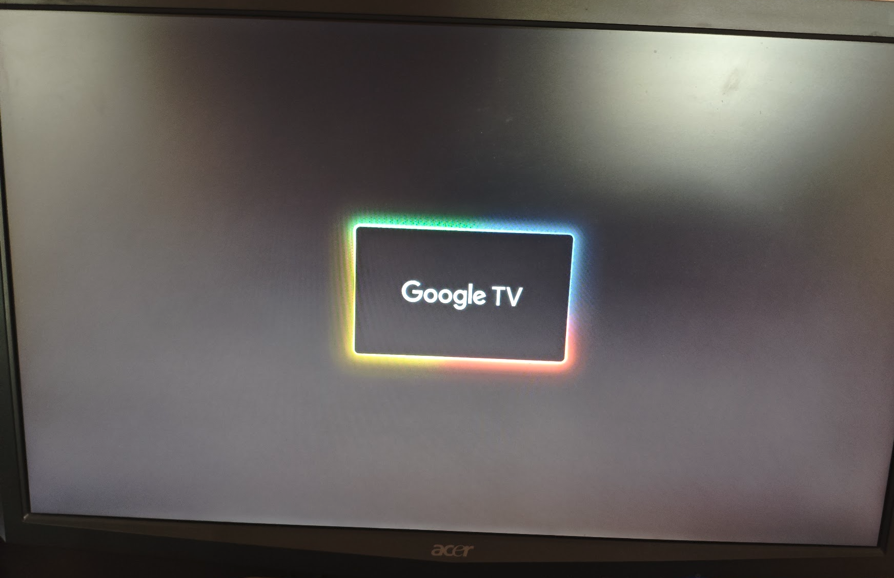

If you're in the same situation as me, the TL;DR is that you're probably cooked. But you can try the [Manufacturer Factory Script Execution](#manufacturer-factory-script-execution) in case it works for you.

## What happened

The unit suffered an unrecoverable boot failure while performing a background application update via the Google Play Store (YouTube TV):

1. A runtime crash occurred during the installation phase (*Zygote crash / soft reboot*).
2. System services failed to recover, triggering an hardware reboot.
3. The device powers on and initiates the Linux kernel, successfully displaying the splash logo and loading the Google TV boot animation. However, the system hangs indefinitely on the animation screen (*boot hang*), indicating corruption within `/data` or `/cache`.

The device has no physical buttons (no recovery switch, no pinhole). Furthermore, the remote control uses Bluetooth LE, which cannot pair during pre-boot or early userland init.

## Standard Android Recovery Methods

### ADB

Because the userland boot sequence never completes (`system_server` does not finish booting), network daemons are never started. The device does not connect to local Wi-Fi, rendering ADB over TCP inaccessible.

### Rescue Party

As for Android Rescue Party, it fails to trigger because the device remains stuck in a userland hang rather than producing a cycle of hard crashes that would increment the persistent crash counter.

### ADNL Mode

The Amlogic S905Y4 bootROM exposes an ephemeral USB download interface (**ADNL mode**) immediately upon receiving power. I connected the device to a Linux machine using a data-capable Micro-USB cable.

* **Attempted Commands:**
```bash
fastboot reboot bootloader
fastboot getvar all
fastboot reboot recovery
fastboot -w
```

However, it was without any success:

```text
FAILED (Write to device failed (No such file or directory))
fastboot: error: Command failed
```

### Manufacturer Factory Script Execution

Official Strong support provided the following recovery instructions:

* Format a USB flash drive as FAT32.
* Create a `/skyworth/` directory at the root.
* Place a raw script named `autotest_command` inside (download [here](./autotest_command.bin)):
```text
reset_system
#showSystemInfo
#checkKeyStatus
#update -o OTA-HP4CEX5M-user-24.12.91.47.zip
```
Note: it wasn't clear if the file needs the `.bin` extension, so i've tried both.

* Connect the drive via a powered Micro-USB OTG Y-cable.

I tested pre-connecting the USB flash drive before boot and connecting it after early boot sequence, across several partition schemes and directory layouts:
* `/skyworth/autotest_command`
* `/autotest_command`
* `/skyworth/factory_mode/uboot/` (alongside `check_udisk.cfg` directives)
* Formats tested: FAT32, MBR partition table.

**No success.**

## Conclusion

Unless the vendor exposes an accessible cold-boot script syntax for U-Boot or releases factory flash packages, recovery on a locked device probably requires physical hardware intervention, making an **RMA return** the most practical solution.